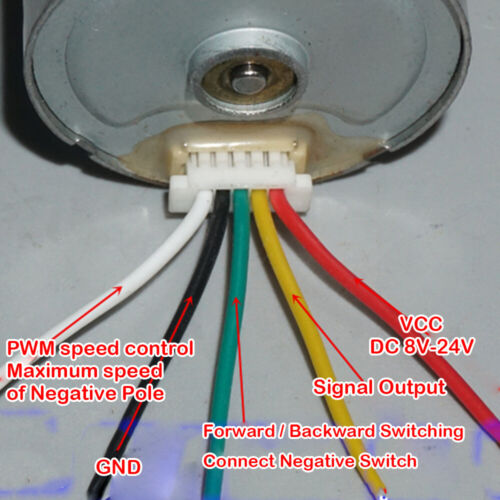

# SpeedoCableReplace
An electronic replacement for a Speedometer Cable from an old car.

This is a simple solution for a broken speedometer cable. 
It uses a sensor on the wheels or on the propshaft and converts
it to a PWM for a small BLDC Motor.
I found some on ebay. They look like this:

This motor should be mounted to the speedometer. The microcontroller is a STM32F103 
maple mini board. The firmware is based on ChibiOS 20 (trunk).